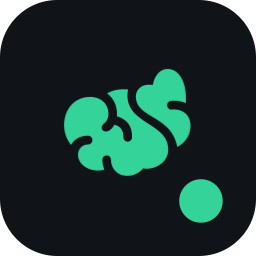
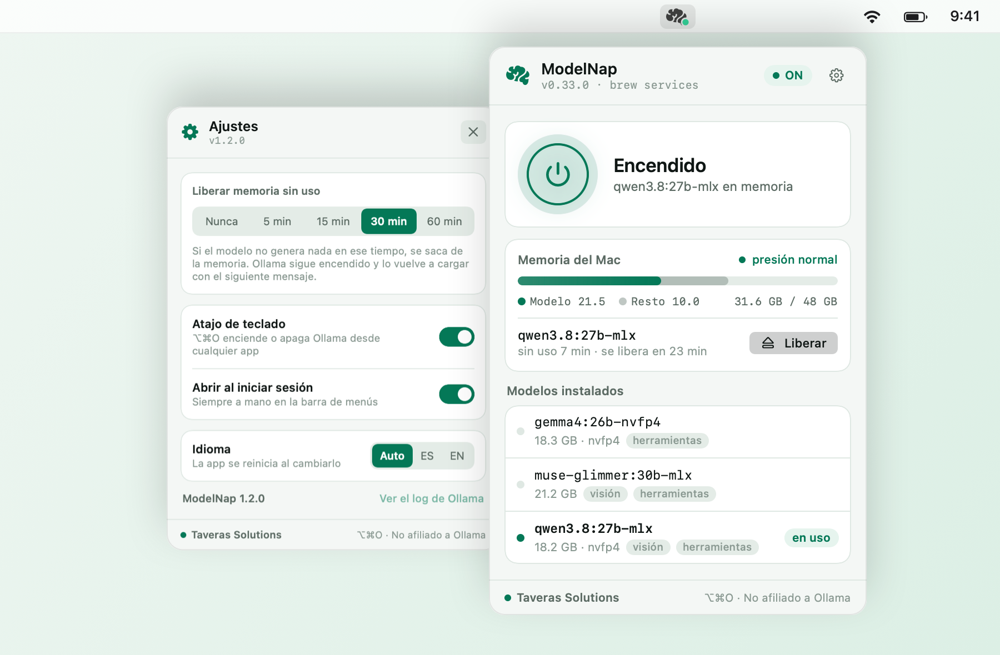
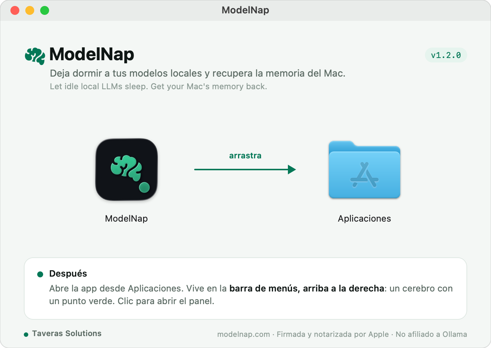
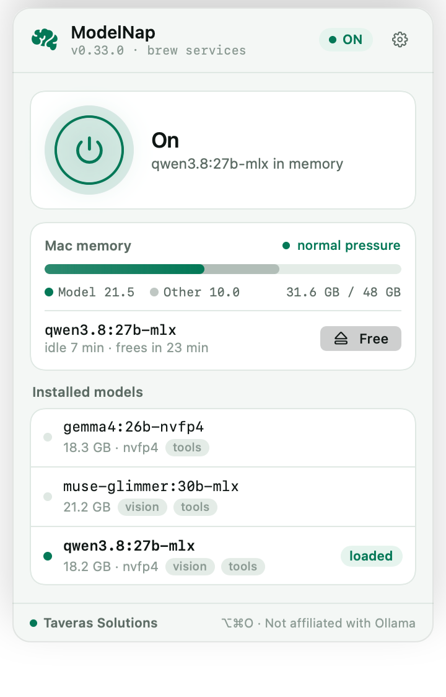

<div align="center">



# ModelNap

**Deja dormir a tus modelos locales y recupera la memoria del Mac.**<br>
<sub>Let idle local LLMs sleep. Get your Mac's memory back.</sub>

[](https://github.com/eriktaveras/modelnap/releases/latest)


[Web](https://modelnap.com) ·
[Descargar](https://github.com/eriktaveras/modelnap/releases/latest) ·
[Funciones](#-funciones) ·
[Instalación](#-instalación) ·
[Cómo funciona](#-cómo-funciona) ·
[Desarrollo](#%EF%B8%8F-desarrollo)

<br>

<picture>
  <source media="(prefers-color-scheme: dark)" srcset="docs/images/hero-dark.png">
  
</picture>

</div>

<br>

## ¿Por qué?

Un modelo local de 20–30 GB se queda en la RAM aunque no lo estés usando. Apagar Ollama tampoco es obvio:
depende de cómo se instaló, y si lo haces por el camino equivocado macOS lo vuelve a arrancar solo.
**ModelNap** deja dormir al modelo cuando no lo usas y te devuelve el control de Ollama con un clic, sin abrir la Terminal.

## ✨ Funciones

| | Función | Detalle |
|:-:|---|---|
| ⏻ | **Encender y apagar** | Un botón en el panel, o **⌥⌘O** desde cualquier app. |
| 🔍 | **Detecta tu instalación** | Ollama.app, `brew services`, un LaunchAgent propio u `ollama serve` a mano. Lo apaga por el mismo camino por el que arranca. |
| 🧹 | **Libera la memoria sin uso** | Tras 5, 15, 30 o 60 minutos sin generar, descarga el modelo. Ollama sigue encendido y lo recarga con el siguiente mensaje. |
| 📊 | **Memoria del Mac** | RAM usada (mismo cálculo que el Monitor de Actividad), qué parte ocupa el modelo y la presión de memoria del sistema. |
| 🗂️ | **Modelos instalados** | Tamaño, cuantización y etiquetas de *visión* y *herramientas*. Carga o libera cualquiera con un clic. |
| 🟢 | **Estado de un vistazo** | Un cerebro en la barra de menús con un punto verde, ámbar o apagado. |
| 🌍 | **Español e inglés** | Sigue el idioma del sistema o elígelo en Ajustes. |
| 🌗 | **Claro y oscuro** | Se adapta a la apariencia de macOS. |
| 🔒 | **Privada** | Solo habla con Ollama en tu Mac. Sin cuentas, sin telemetría, sin analítica. |

## 📥 Instalación

1. Descarga **`ModelNap-1.2.0.dmg`** desde [Releases](https://github.com/eriktaveras/modelnap/releases/latest).
2. Ábrelo y arrastra la app a **Aplicaciones**.
3. Ábrela: aparece en la **barra de menús, arriba a la derecha**.

<p align="center">
  
</p>

> [!NOTE]
> La app y el instalador van **firmados con Developer ID y notarizados por Apple**: abren sin avisos de Gatekeeper.
> Para verificar la descarga: `shasum -a 256 -c ModelNap-1.2.0.dmg.sha256`

**Requisitos:** macOS 14 Sonoma o superior · Apple Silicon o Intel · [Ollama](https://ollama.com/download) instalado.

## 🧭 Uso

### En la barra de menús

<picture>
  <source media="(prefers-color-scheme: dark)" srcset="docs/images/menubar-dark.png">
  
</picture>

| Acción | Resultado |
|---|---|
| **Clic** en el cerebro | Abre el panel |
| **Clic derecho** | Encender/apagar, ver el log de Ollama, abrir al iniciar sesión, *Acerca de*, salir |
| **⌥⌘O** | Enciende o apaga Ollama desde cualquier app |

### Ajustes

Desde el engranaje del panel:

- **Liberar memoria sin uso** — nunca, 5, 15, 30 o 60 min.
- **Atajo de teclado** — activa o desactiva ⌥⌘O.
- **Abrir al iniciar sesión** — la app pregunta la primera vez, no se añade sola.
- **Idioma** — automático, español o inglés.

## ⚙️ Cómo funciona

### Apagar Ollama por el camino correcto

Matar el proceso no siempre sirve: un LaunchAgent con `KeepAlive` lo relanza al instante. La app detecta el
mecanismo y usa el suyo.

| Si Ollama viene de… | Apagar | Encender | Verificado |
|---|---|---|:-:|
| **Ollama.app** (ollama.com) | Cierra la app | Abre la app | ⏳ pendiente |
| **`brew services`** o LaunchAgent propio | `launchctl bootout` | `launchctl bootstrap` | ✅ |
| **`ollama serve`** a mano | `SIGTERM` al servidor | Lanza `ollama serve` | ✅ |
| **No instalado** | — | Lleva a ollama.com/download | ✅ |

Detección, por orden: Ollama.app en marcha → LaunchAgent cargado → `ollama serve` suelto → lo que haya
instalado. Si Ollama está apagado, recuerda el último mecanismo con el que estuvo encendido.

### Detectar un modelo «sin uso»

Ollama no expone la hora de la última petición. Cada modelo cargado corre en un proceso `ollama runner` que
solo gasta CPU mientras trabaja:

| Medición (gemma4 26B, Apple M5 Pro) | CPU del runner |
|---|---:|
| 30 s en reposo | +0,06 s |
| Generar 104 tokens | +0,99 s |

Cada 2,5 s la app suma la CPU de los runners (`proc_pid_rusage`). Si sube más de **0,08 s**, o cambia el modelo
cargado, cuenta como uso. La lógica vive en [`IdleTracker`](Sources/Activity.swift) y está cubierta por pruebas.

### Por qué no está en la Mac App Store

La App Store exige **App Sandbox**. Con el sandbox activo, lo medimos: `launchctl` devuelve *Bad request*,
enviar señales a otros procesos da `EPERM` y cerrar otra app se rechaza. Leer el estado por la API sí
funciona, pero apagar Ollama no. Por eso se distribuye firmada y notarizada fuera de la tienda.

## 🌍 Idiomas



La interfaz está en **español** (idioma base) e **inglés**. Por defecto sigue el idioma de macOS; se puede
fijar en **Ajustes › Idioma**.

Las traducciones viven en `Resources/<idioma>.lproj/Localizable.strings`. La clave de cada frase es el propio
texto en español, así el código se lee igual que la interfaz. Para añadir un idioma basta con crear otra
carpeta `.lproj` con las mismas claves.

<br clear="right">

## 🔒 Privacidad

- Solo se conecta a la API local de Ollama (`127.0.0.1:11434`, o `OLLAMA_HOST` si está definido).
- No hay cuentas, telemetría ni analítica, y no envía nada a internet.
- Las únicas páginas externas que abre son las que pulses: ollama.com/download, modelnap.com y taverassolutions.com.

## 🛠️ Desarrollo

App nativa (AppKit + SwiftUI) **sin proyecto de Xcode**: se compila con `swiftc` directamente.

**Requisitos:** Xcode 26 con Swift 6.3 (es con lo que se compila; versiones anteriores sin probar) · [uv](https://docs.astral.sh/uv/) para empaquetar el `.dmg`.

```bash
./build.sh              # app en ./build (binario universal, firma ad-hoc)
./build.sh --install    # además la copia a ~/Applications y la relanza
./build.sh --test       # pruebas de IdleTracker
./docs/generate-images.sh   # regenera las imágenes de este README
```

### Publicar una versión

```bash
echo 1.3.0 > VERSION
DEVELOPER_ID="Developer ID Application: Erik Manuel Taveras Tavarez (794R79NU32)" \
NOTARY_PROFILE=taveras-notary ./package.sh
```

`package.sh` firma con runtime endurecido, **notariza y grapa** la app y el `.dmg`, y deja
`dist/ModelNap-<versión>.dmg` con su `.sha256`. Las credenciales de notarización viven en el
llavero (`xcrun notarytool store-credentials`). Sin esas variables sale una build ad-hoc solo para pruebas.

### Herramientas de línea de comandos

```bash
B="/Applications/ModelNap.app/Contents/MacOS/ModelNap"
"$B" --status                 # mecanismo detectado y si la API responde
"$B" --on | --off             # mismo camino que el botón del panel
"$B" --memory                 # memoria del Mac y CPU de los runners
"$B" --idle-test 20           # prueba la liberación automática con 20 s de límite
"$B" --snapshot panel.png [light|dark] [settings] [demo] [-AppleLanguages "(en)"]
```

### Estructura

```text
Sources/
├── main.swift            Arranque, barra de menús, menú contextual y modos de terminal
├── Ollama.swift          Detección del mecanismo, encendido/apagado, API de Ollama y estado
├── Activity.swift        CPU de los runners e IdleTracker («sin uso»)
├── SystemMemory.swift    Memoria usada y presión del sistema
├── HotKey.swift          Atajo global ⌥⌘O (Carbon, sin permiso de Accesibilidad)
├── ContentView.swift     Panel, memoria, modelos y ajustes
├── Theme.swift           Colores y tipografía
├── Mark.swift            Ícono de la barra y de la app
└── L10n.swift            Traducciones y selector de idioma
Resources/                es.lproj y en.lproj
Tests/                    Pruebas de IdleTracker
Tools/                    Ícono, fondo del dmg e imágenes del README
packaging/                Ajustes de dmgbuild
```

## 🗺️ Hoja de ruta

- [ ] Actualizaciones automáticas con [Sparkle](https://sparkle-project.org)
- [ ] Probar la detección con Ollama.app
- [ ] Atajos de Apple y Siri («Apagar Ollama»)
- [ ] Descargar y borrar modelos desde el panel
- [ ] Enlaces `modelnap://on|off` para Raycast y Alfred
- [ ] Web en [modelnap.com](https://modelnap.com) con descarga pública
- [ ] Control en el Centro de Control (macOS 26)

Historial de cambios en [CHANGELOG.md](CHANGELOG.md).

## ❓ Preguntas frecuentes

<details>
<summary><b>¿Es de Ollama?</b></summary>
<br>
No. Es un proyecto independiente de Taveras Solutions, sin afiliación con Ollama.
</details>

<details>
<summary><b>¿Qué pasa con mis apps que usan Ollama cuando está apagado?</b></summary>
<br>
No responden hasta que lo enciendas. Si solo quieres recuperar RAM, usa <i>Liberar</i> o la liberación automática: Ollama sigue encendido y recarga el modelo con el siguiente mensaje.
</details>

<details>
<summary><b>¿Vuelve a arrancar al reiniciar el Mac?</b></summary>
<br>
Depende de tu instalación. Si Ollama arranca con el sistema (Ollama.app como ítem de inicio o <code>brew services</code>), volverá a hacerlo. La app no modifica esa configuración.
</details>

<details>
<summary><b>El atajo ⌥⌘O no hace nada</b></summary>
<br>
Puede que otra app use la misma combinación: macOS no avisa de esos conflictos entre apps. Desactívalo en Ajustes o cambia el atajo de la otra app.
</details>

<details>
<summary><b>¿Hace más rápidos los modelos?</b></summary>
<br>
No. Libera memoria y te deja controlar cuándo está encendido Ollama; la velocidad depende del modelo y del Mac.
</details>

---

<div align="center">
<sub>
<a href="https://modelnap.com"><b>modelnap.com</b></a> · Hecho por <a href="https://taverassolutions.com"><b>Taveras Solutions</b></a> ·
© 2026 Taveras Solutions LLC. Todos los derechos reservados.<br>
Ollama es una marca de sus respectivos propietarios. Este proyecto no está afiliado a Ollama.
</sub>
</div>
