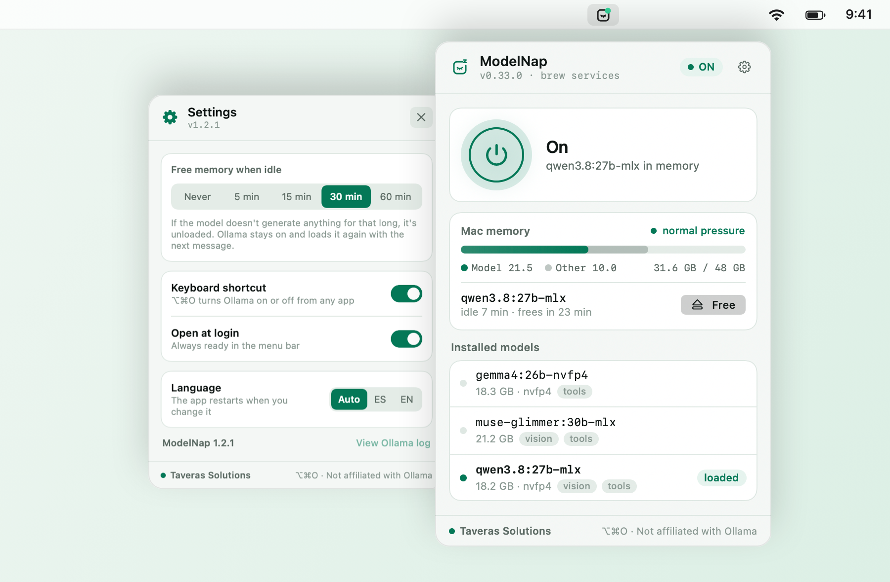
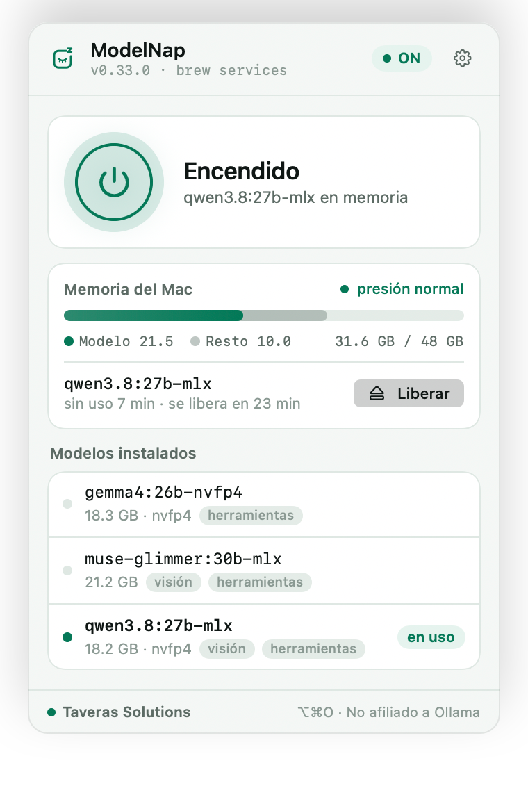
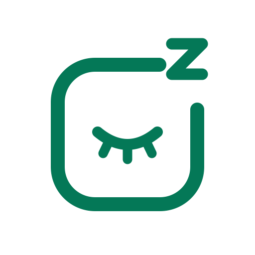

<div align="center">


# ModelNap

**Let idle local LLMs sleep. Get your Mac's memory back.**

**English** · [Español](README.es.md)

[](https://github.com/eriktaveras/modelnap/releases/latest)


[](LICENSE)
[](https://github.com/eriktaveras/modelnap/actions/workflows/build.yml)

[Website](https://modelnap.com) ·
[Download](https://github.com/eriktaveras/modelnap/releases/latest) ·
[Features](#-features) ·
[Install](#-install) ·
[How it works](#%EF%B8%8F-how-it-works) ·
[Development](#%EF%B8%8F-development) ·
[Contributing](#-contributing)

<br>

<picture>
  <source media="(prefers-color-scheme: dark)" srcset="docs/images/hero-en-dark.png">
  
</picture>

</div>

<br>

## Why?

A 20–30 GB local model stays in RAM even when you're not using it. Turning Ollama off isn't obvious either:
it depends on how it was installed, and if you do it the wrong way, macOS starts it again on its own.
**ModelNap** lets the model sleep when you don't need it and gives you one-click control over Ollama, no Terminal required.

## ✨ Features

| | Feature | Details |
|:-:|---|---|
| ⏻ | **Turn on and off** | A button in the panel, or **⌥⌘O** from any app. |
| 🔍 | **Detects your install** | Ollama.app, `brew services`, your own LaunchAgent or a manual `ollama serve`. It stops Ollama the same way it starts. |
| 🧹 | **Frees idle memory** | After 5, 15, 30 or 60 minutes without generating, it unloads the model. Ollama stays on and reloads it with the next message. |
| 📊 | **Mac memory** | RAM in use (same calculation as Activity Monitor), how much of it is the model, and the system's memory pressure. |
| 🗂️ | **Installed models** | Size, quantization and *vision* / *tools* tags. Load or free any of them in one click. |
| 🟢 | **Status at a glance** | The logo in the menu bar, with a green, amber or no dot. |
| 🌍 | **English and Spanish** | Follows the system language, or pick one in Settings. |
| 🌗 | **Light and dark** | Matches your macOS appearance. |
| 🔒 | **Private** | Only talks to Ollama on your Mac. No accounts, no telemetry, no analytics. |
| 🧾 | **Open source** | MIT licensed: you can check exactly what it does. |

## 📥 Install

1. Download **`ModelNap-1.2.1.dmg`** from [Releases](https://github.com/eriktaveras/modelnap/releases/latest).
2. Open it and drag the app to **Applications**.
3. Launch it: it shows up in the **menu bar, top right**.

<p align="center">
  
</p>

> [!NOTE]
> The app and the installer are **signed with a Developer ID and notarized by Apple**, so they open without Gatekeeper warnings.
> To verify the download: `shasum -a 256 -c ModelNap-1.2.1.dmg.sha256`

**Requirements:** macOS 14 Sonoma or later · Apple Silicon or Intel · [Ollama](https://ollama.com/download) installed.

## 🧭 Usage

### In the menu bar

<picture>
  <source media="(prefers-color-scheme: dark)" srcset="docs/images/menubar-en-dark.png">
  
</picture>

| Action | Result |
|---|---|
| **Click** the icon | Opens the panel |
| **Right-click** | Turn on/off, view the Ollama log, open at login, *About*, quit |
| **⌥⌘O** | Turns Ollama on or off from any app |

### Settings

From the gear in the panel:

- **Free memory when idle** — never, 5, 15, 30 or 60 min.
- **Keyboard shortcut** — turn ⌥⌘O on or off.
- **Open at login** — the app asks the first time and never adds itself.
- **Language** — automatic, English or Spanish.

## ⚙️ How it works

### Stopping Ollama the right way

Killing the process doesn't always work: a LaunchAgent with `KeepAlive` brings it right back. ModelNap detects the
mechanism and uses its own.

| If Ollama comes from… | Stop | Start | Verified |
|---|---|---|:-:|
| **Ollama.app** (ollama.com) | Quits the app | Opens the app | ⏳ pending |
| **`brew services`** or your own LaunchAgent | `launchctl bootout` | `launchctl bootstrap` | ✅ |
| **Manual `ollama serve`** | `SIGTERM` to the server | Launches `ollama serve` | ✅ |
| **Not installed** | — | Opens ollama.com/download | ✅ |

Detection order: running Ollama.app → loaded LaunchAgent → standalone `ollama serve` → whatever is installed.
While Ollama is off, it remembers the last mechanism it was running with.

### Detecting an idle model

Ollama doesn't expose when the last request happened. Each loaded model runs in an `ollama runner` process that
only uses CPU while it's working:

| Measurement (gemma4 26B, Apple M5 Pro) | Runner CPU time |
|---|---:|
| 30 s idle | +0.06 s |
| Generating 104 tokens | +0.99 s |

Every 2.5 s the app adds up the runners' CPU time (`proc_pid_rusage`). If it grows by more than **0.08 s**, or the
loaded model changes, that counts as activity. The logic lives in [`IdleTracker`](Sources/Activity.swift) and is covered by tests.

### Why it isn't on the Mac App Store

The App Store requires **App Sandbox**. We measured it with the sandbox on: `launchctl` returns *Bad request*,
signals to other processes fail with `EPERM`, and quitting another app is refused. Reading Ollama's state through
the API works, but stopping it doesn't. That's why ModelNap ships signed and notarized outside the store.

## 🌍 Languages

The interface is available in **English** and **Spanish** (the base language). It follows your macOS language by
default, or you can set it in **Settings › Language**.

<p align="center">
  
</p>

Translations live in `Resources/<language>.lproj/Localizable.strings`. Each key is the Spanish text itself, so the
code reads like the interface. To add a language, create another `.lproj` folder with the same keys.

## 🎨 Brand



The logo is a **model taking a nap**: a rounded frame with a closed eye and a "z" escaping through the corner. It's
an original drawing defined in [`Sources/Logo.swift`](Sources/Logo.swift), which generates the app icon, the
menu bar icon, the installer and the web assets in [`docs/logo`](docs/logo): SVG in four colors, PNG,
`favicon.ico`, `favicon.svg` and `apple-touch-icon.png`.

<br clear="left">

| Use | Color |
|---|---|
| Primary green (dark backgrounds) | `#34D399` |
| Forest green (light backgrounds) | `#047857` |
| "z" on the icon | `#A7F3D0` |
| Icon background | `#101318` |

## 🔒 Privacy

- It only connects to Ollama's local API (`127.0.0.1:11434`, or `OLLAMA_HOST` if set).
- No accounts, telemetry or analytics, and nothing is sent to the internet. The code is open, so you can check.
- The only external pages it opens are the ones you click: ollama.com/download, modelnap.com and taverassolutions.com.

## 🛠️ Development

A native app (AppKit + SwiftUI) **without an Xcode project**: it builds straight with `swiftc`.

**Requirements:** Xcode 26 with Swift 6.3 (what it's built with; older versions untested) · [uv](https://docs.astral.sh/uv/) to package the `.dmg`.

```bash
./build.sh                  # app in ./build (universal binary, ad-hoc signed)
./build.sh --install        # also copies it to ~/Applications and relaunches it
./build.sh --test           # IdleTracker tests
./docs/generate-images.sh   # regenerates this README's images and the logo
```

### Releasing a version

```bash
echo 1.3.0 > VERSION
DEVELOPER_ID="Developer ID Application: Erik Manuel Taveras Tavarez (794R79NU32)" \
NOTARY_PROFILE=taveras-notary ./package.sh
```

`package.sh` signs with the hardened runtime, **notarizes and staples** both the app and the `.dmg`, and leaves
`dist/ModelNap-<version>.dmg` with its `.sha256`. Notarization credentials live in the keychain
(`xcrun notarytool store-credentials`). Without those variables you get an ad-hoc build for local testing only.

### Command-line tools

```bash
B="/Applications/ModelNap.app/Contents/MacOS/ModelNap"
"$B" --status                 # detected mechanism and whether the API responds
"$B" --on | --off             # same path as the panel button
"$B" --memory                 # Mac memory and runner CPU time
"$B" --idle-test 20           # tests auto-free with a 20 s limit
"$B" --snapshot panel.png [light|dark] [settings] [demo] [-AppleLanguages "(en)"]
```

### Project layout

```text
Sources/
├── main.swift            Startup, menu bar, context menu and command-line modes
├── Ollama.swift          Mechanism detection, on/off, Ollama API and state
├── Activity.swift        Runner CPU time and IdleTracker (idle detection)
├── SystemMemory.swift    Memory in use and system pressure
├── HotKey.swift          Global ⌥⌘O shortcut (Carbon, no Accessibility permission)
├── ContentView.swift     Panel, memory, models and settings
├── Theme.swift           Colors and typography
├── Logo.swift            Logo geometry (icon, menu bar, dmg and web)
├── Mark.swift            Menu bar icon, header and app icon
└── L10n.swift            Translations and language picker
Resources/                es.lproj and en.lproj
Tests/                    IdleTracker tests
Tools/                    Icon, logo, dmg background and README images
docs/logo/                Web logo assets (SVG, PNG, favicon)
packaging/                dmgbuild settings
```

## 🗺️ Roadmap

- [ ] Automatic updates with [Sparkle](https://sparkle-project.org)
- [ ] Verify detection with Ollama.app
- [ ] Apple Shortcuts and Siri ("Turn off Ollama")
- [ ] Download and delete models from the panel
- [ ] `modelnap://on|off` links for Raycast and Alfred
- [x] Website at [modelnap.com](https://modelnap.com) with public download
- [ ] Control Center toggle (macOS 26)

See [CHANGELOG.md](CHANGELOG.md) for the release history.

## 🤝 Contributing

Contributions are welcome. Where help matters most right now:

- 🧪 **Testing with Ollama.app** and on **Intel Macs**: open an [issue](https://github.com/eriktaveras/modelnap/issues/new/choose) and tell us how it went.
- 🌍 **Translations**: copy `Resources/en.lproj` to your language.
- 🔌 **Other engines** (LM Studio, MLX, llama.cpp): propose the approach in an issue before writing code.

Please read [CONTRIBUTING.md](CONTRIBUTING.md) before opening a PR. Report security issues privately
(see [SECURITY.md](SECURITY.md)).

## ❓ FAQ

<details>
<summary><b>Is it made by Ollama?</b></summary>
<br>
No. It's an independent project by Taveras Solutions, not affiliated with Ollama.
</details>

<details>
<summary><b>What happens to my apps that use Ollama while it's off?</b></summary>
<br>
They won't respond until you turn it back on. If you only want your RAM back, use <i>Free</i> or auto-free when idle: Ollama stays on and reloads the model with the next message.
</details>

<details>
<summary><b>Does Ollama start again when I restart my Mac?</b></summary>
<br>
It depends on your install. If Ollama starts with the system (Ollama.app as a login item, or <code>brew services</code>), it will start again. ModelNap doesn't change that configuration.
</details>

<details>
<summary><b>The ⌥⌘O shortcut does nothing</b></summary>
<br>
Another app may be using the same combination: macOS doesn't report conflicts between apps. Turn it off in Settings or change the other app's shortcut.
</details>

<details>
<summary><b>Can I fork it?</b></summary>
<br>
Yes, the code is MIT. If you distribute a modified build, give it a different name, logo and bundle identifier: the "ModelNap" name and logo are reserved (see <a href="TRADEMARKS.md">TRADEMARKS.md</a>).
</details>

<details>
<summary><b>Does it make models faster?</b></summary>
<br>
No. It frees memory and lets you control when Ollama is running; speed depends on the model and your Mac.
</details>

---

<div align="center">
<sub>
<a href="https://modelnap.com"><b>modelnap.com</b></a> · Made by <a href="https://taverassolutions.com"><b>Taveras Solutions</b></a> ·
Code under the <a href="LICENSE">MIT License</a> · the ModelNap name and logo are reserved (<a href="TRADEMARKS.md">TRADEMARKS.md</a>).<br>
Ollama is a trademark of its respective owners. This project is not affiliated with Ollama.
</sub>
</div>
